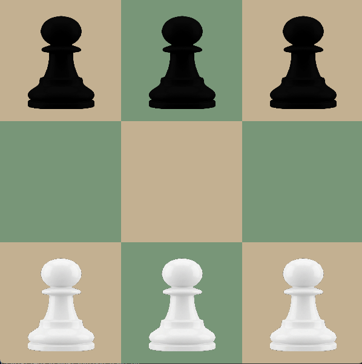

# HexapawnRL

A comprehensive reinforcement learning implementation for the classic Hexapawn game, featuring multiple training methodologies.

## About Hexapawn

<div align="center">
  
</div>

Hexapawn is a deterministic two-player board game invented by Martin Gardner. It's played on a 3×3 board with pawns that move and capture like chess pawns. The game serves as an excellent testbed for machine learning algorithms due to its:

- **Simple rules**: Easy to understand and implement
- **Finite state space**: Perfect for exhaustive analysis
- **Strategic depth**: Despite simplicity, requires tactical thinking
- **Educational value**: Ideal for demonstrating AI concepts

### Game Rules
- Each player starts with 3 pawns on their back rank
- Pawns move forward one square or capture diagonally forward
- A player wins by:
  - Getting a pawn to the opposite end
  - Capturing all opponent pawns
  - Blocking all opponent moves

## Features

- **Brute Force Solver**: Complete game tree analysis
<!-- - **Neural Network Integration**: Deep learning approaches to game strategy -->
- **Modular Architecture**: Clean separation of game logic, training, and utilities
<!-- - **Comprehensive Training**: Different methodologies for algorithm comparison -->
<!-- - **Performance Analytics**: Built-in tools for analyzing agent performance -->

## Project Structure

```
HexaPawnRL/
├── assets/ # Contains game icons and images.
├── brute_force/ # Implementation of the brute force solver for Hexapawn.
├── HER/ # Implementation of Hexapawn Educable Robot (HER) algorithm.
├── HIM/ # Implementation of Hexapawn Instructable Matchboxes (HIM) algorithm.
├── game.py # Main game logic and interface.
├── README.md # Project documentation and instructions.
├── requirements.txt # List of dependencies for the project.
```

## Installation

### Prerequisites
- Python 3.8 or higher
- pip package manager

### Setup
1. Clone the repository:
```bash
git clone https://github.com/JayPatil9/HexaPawnRL.git
cd HexaPawnRL
```

2. Create a virtual environment (recommended):
```bash
python -m venv venv
source venv/bin/activate  # On Windows: venv\Scripts\activate
```

3. Install dependencies:
```bash
pip install -r requirements.txt
```

## Quick Start

### Running the Game
```bash
python game.py
```

<!-- ### Training Agents
Each algorithm folder contains its own training implementation. Refer to the README.md file in each algorithm's folder for specific training instructions and parameters.

**Note**: Detailed training instructions and configuration options are explained in the README.md file of each algorithm/method's folder. -->

## Future Enhancements
  
- [ ] **Enhanced Features**
  - GUI interface for human vs AI play
  - Tournament system for algorithm comparison
  - Real-time training visualization
  
- [ ] **Optimization**
  - Memory-efficient training algorithms
  
- [ ] **Analysis Tools**
  - Game tree visualization

## Contributing

Contributions are welcome! Please feel free to submit a Pull Request. For major changes, please open an issue first to discuss what you would like to change.

## Acknowledgments

- Martin Gardner for inventing the Hexapawn game
- The reinforcement learning community for algorithmic insights
